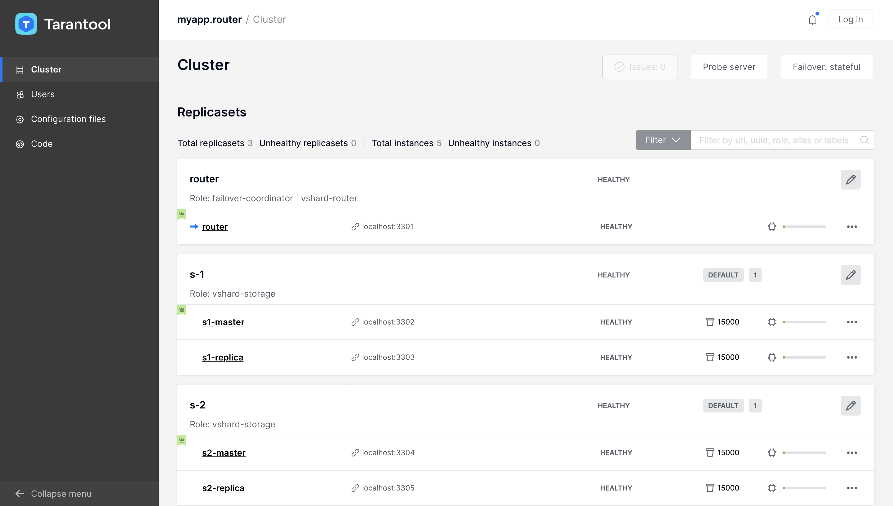

.. _cartridge_readme:

================================================================================
Tarantool Cartridge
================================================================================

A framework for distributed applications development.

.. raw:: html

  

    
    
     
    
     
    
  

.. raw:: html

  

    
  

.. contents::

--------------------------------------------------------------------------------
About Tarantool Cartridge
--------------------------------------------------------------------------------

Tarantool Cartridge allows you to easily develop Tarantool-based applications
and run them on one or more Tarantool instances organized into a cluster.

This is the recommended alternative to the
`old-school practices <https://www.tarantool.io/en/doc/latest/book/app_server/>`_
of application development for Tarantool.

As a **software development kit (SDK)**, Tarantool Cartridge provides you with
utilities and an application template to help:

* easily set up a development environment for your applications;
* plug the necessary Lua modules.

The resulting package can be installed and started on one or multiple servers
as one or multiple instantiated services |--| independent or organized into a
**cluster**.

A Tarantool cluster is a collection of Tarantool instances acting in concert.
While a single Tarantool instance can leverage the performance of a single server
and is vulnerable to failure, the cluster spans multiple servers, utilizes their
cumulative CPU power, and is fault-tolerant.

To fully utilize the capabilities of a Tarantool cluster, you need to
develop applications keeping in mind they are to run in a cluster environment.

As a **cluster management tool**, Tarantool Cartridge provides your cluster-aware
applications with the following key benefits:

* horizontal scalability and load balancing via built-in automatic sharding;
* asynchronous replication;
* automatic failover;
* centralized cluster control via GUI or API;
* automatic configuration synchronization;
* instance functionality segregation.

A Tarantool Cartridge cluster can segregate functionality between instances via
built-in and custom (user-defined) **cluster roles**. You can toggle instances
on and off on the fly during cluster operation. This allows you to put
different types of workloads (e.g., compute- and transaction-intensive ones) on
different physical servers with dedicated hardware.

Tarantool Cartridge has an external utility called
`cartridge-cli <https://github.com/tarantool/cartridge-cli>`_ which
provides you with utilities and an application template to help:

* easily set up a development environment for your applications;
* plug the necessary Lua modules;
* pack the applications in an environment-independent way: together with
  module binaries and Tarantool executables.

--------------------------------------------------------------------------------
Getting started
--------------------------------------------------------------------------------

~~~~~~~~~~~~~~~~~~~~~~~~~~~~~~~~~~~~~~~~~~~~~~~~~~~~~~~~~~~~~~~~~~~~~~~~~~~~~~~~
Prerequisites
~~~~~~~~~~~~~~~~~~~~~~~~~~~~~~~~~~~~~~~~~~~~~~~~~~~~~~~~~~~~~~~~~~~~~~~~~~~~~~~~

To get a template application that uses Tarantool Cartridge and run it,
you need to install several packages:

* ``tarantool`` and ``tarantool-dev``
  (see these `instructions <https://www.tarantool.io/en/download/>`__);
* ``cartridge-cli``
  (see these `instructions <https://github.com/tarantool/cartridge-cli#installation>`__)
* ``git``, ``gcc``, ``cmake`` and ``make``.

~~~~~~~~~~~~~~~~~~~~~~~~~~~~~~~~~~~~~~~~~~~~~~~~~~~~~~~~~~~~~~~~~~~~~~~~~~~~~~~~
Create your first application
~~~~~~~~~~~~~~~~~~~~~~~~~~~~~~~~~~~~~~~~~~~~~~~~~~~~~~~~~~~~~~~~~~~~~~~~~~~~~~~~

Long story short, enter these commands into the console one-by-one:

.. code-block:: bash

    cartridge create --name myapp
    cd myapp
    cartridge build
    cartridge start -d
    cartridge replicasets setup --bootstrap-vshard
    cartridge failover set stateful --state-provider stateboard --provider-params '{"uri": "localhost:4401", "password": "passwd"}'

That's all! Now you can visit http://localhost:8081 and see your application's
Admin Web UI:

~~~~~~~~~~~~~~~~~~~~~~~~~~~~~~~~~~~~~~~~~~~~~~~~~~~~~~~~~~~~~~~~~~~~~~~~~~~~~~~~
Next steps
~~~~~~~~~~~~~~~~~~~~~~~~~~~~~~~~~~~~~~~~~~~~~~~~~~~~~~~~~~~~~~~~~~~~~~~~~~~~~~~~

See:

* A more detailed
  `getting started guide <https://www.tarantool.io/en/doc/latest/getting_started/getting_started_cartridge/>`_
* More
  `application examples <https://github.com/tarantool/examples>`_
* `Cartridge documentation <https://www.tarantool.io/en/doc/latest/book/cartridge/>`_
* `Cartridge API reference <https://www.tarantool.io/en/doc/latest/book/cartridge/cartridge_api/>`_

--------------------------------------------------------------------------------
Contributing
--------------------------------------------------------------------------------

The most essential contribution is your *feedback*, don't hesitate to
`open an issue <https://github.com/tarantool/cartridge/issues/new>`_.
If you'd like to propose some changes in code, see the contribution
`guide <https://github.com/tarantool/cartridge/blob/master/CONTRIBUTING.rst>`_.

.. |--| unicode:: U+2013   .. en dash
.. |---| unicode:: U+2014  .. em dash, trimming surrounding whitespace
   :trim:
