.. _cartridge-admin:

===============================================================================
Administrator's guide
===============================================================================

This guide explains how to deploy and manage a Tarantool cluster with Tarantool
Cartridge.

..  note::

    For more information on managing Tarantool instances, see the
    `server administration section <https://www.tarantool.io/en/doc/latest/book/admin/>`__
    of the Tarantool manual.

Before deploying the cluster, familiarize yourself with the notion of
:ref:`cluster roles <cartridge-roles>` and
:ref:`deploy Tarantool instances <cartridge-deploy>` according to the
desired cluster topology.

.. _cartridge-compatibility:

-------------------------------------------------------------------------------
Versions compatibility and known issues about upgrading
-------------------------------------------------------------------------------

Cartridge is compatible with Tarantool 1.10 and Tarantool 2.x.
Cartridge doesn't support Tarantool 3.0 and higher.

.. list-table:: Compatibility and known issues
   :widths: 50 50 50 50 50 50
   :header-rows: 1
   :stub-columns: 1

   * -
     - Tarantool 1.10
     - Tarantool 2.8
     - Tarantool 2.10
     - Tarantool 2.11
     - Additional notes
   * - Cartridge 2.15.5
     - \+
     - \-
     - \+
     - \+
     -
   * - Cartridge 2.15.4
     - \+
     - \-
     - \+
     - \+
     -
   * - Cartridge 2.15.3
     - \+
     - \-
     - \+
     - \+
     -
   * - Cartridge 2.15.2
     - \+
     - \+
     - \+
     - \+
     -
   * - Cartridge 2.15.1
     - \+
     - \+
     - \+
     - \+
     -
   * - Cartridge 2.15.0
     - \+
     - \+
     - \+
     - \+
     -
   * - Cartridge 2.14.0
     - \+
     - \+
     - \+
     - \+
     -
   * - Cartridge 2.13.0
     - \+
     - \+
     - \+
     - \+
     -
   * - Cartridge 2.12.4
     - \+
     - \+
     - \+
     - \+
     -
   * - Cartridge 2.12.3
     - \+
     - \+
     - \+
     - \+
     -
   * - Cartridge 2.12.2
     - \+
     - \+
     - \+
     - \+
     -
   * - Cartridge 2.12.1
     - \+
     - \+
     - \+
     - \+
     -
   * - Cartridge 2.12.0
     - \+
     - \+
     - \+
     - \+
     - Cartridge uses enterprise versions of ``vshard`` and ``ddl`` if available
   * - Cartridge 2.11.0
     - \+
     - \+
     - \+
     - \+
     -
   * - Cartridge 2.10.0
     - \+
     - \+
     - \+
     - \+
     -
   * - Cartridge 2.9.0
     - \+
     - \+
     - \+
     - \+
     - Can't be downgraded to Cartridge 2.7.9 and lower
       Contains a serious bug in ``membership``
   * - Cartridge 2.8.6
     - \+
     - \+
     - \+
     - \+
     - Contains a serious bug in ``membership``
   * - Cartridge 2.8.5
     - \+
     - \+
     - \+
     - \+
     -
   * - Cartridge 2.8.4
     - \+
     - \+
     - \+
     - \+
     -
   * - Cartridge 2.8.3
     - \+
     - \+
     - \+
     - \+
     -
   * - Cartridge 2.8.2
     - \+
     - \+
     - \+
     - \+
     -
   * - Cartridge 2.8.1
     - \+
     - \+
     - \+
     - \+
     -
   * - Cartridge 2.8.0
     - \+
     - \+
     - \+
     - \+
     -
   * - Cartridge 2.7.9
     - \+
     - \+
     - \+
     - \+
     -
   * - Cartridge 2.7.8
     - \+
     - \+
     - \+
     - \-
     - Update to this release is broken
   * - Cartridge 2.7.7
     - \+
     - \+
     - \+
     - \-
     - Update to this release is broken
   * - Cartridge 2.7.6
     - \+
     - \+
     - \+
     - \-
     - Update to this release is broken
   * - Cartridge 2.7.5
     - \+
     - \+
     - \+
     - \-
     -
   * - Cartridge 2.7.4
     - \+
     - \+
     - \+
     - \-
     -
   * - Cartridge 2.7.3
     - \+
     - \+
     - \-
     - \-
     -
   * - Cartridge 2.7.2
     - \+
     - \+
     - \-
     - \-
     -
   * - Cartridge 2.7.1
     - \+
     - \+
     - \-
     - \-
     -
   * - Cartridge 2.7.0
     - \+
     - \+
     - \-
     - \-
     - Can't be downgraded to Cartridge 2.6.0 and lower

.. _cartridge-deployment:

-------------------------------------------------------------------------------
Deploying the cluster
-------------------------------------------------------------------------------

To deploy the cluster, first, :ref:`configure <cartridge-config>` your
Tarantool instances according to the desired cluster topology, for example:

..  code-block:: yaml

    my_app.router: {"advertise_uri": "localhost:3301", "http_port": 8080, "workdir": "./tmp/router"}
    my_app.storage_A_master: {"advertise_uri": "localhost:3302", "http_enabled": False, "workdir": "./tmp/storage-a-master"}
    my_app.storage_A_replica: {"advertise_uri": "localhost:3303", "http_enabled": False, "workdir": "./tmp/storage-a-replica"}
    my_app.storage_B_master: {"advertise_uri": "localhost:3304", "http_enabled": False, "workdir": "./tmp/storage-b-master"}
    my_app.storage_B_replica: {"advertise_uri": "localhost:3305", "http_enabled": False, "workdir": "./tmp/storage-b-replica"}

Then :ref:`start the instances <cartridge-run>`, for example using
``cartridge`` CLI:

..  code-block:: bash

    $ cartridge start my_app --cfg demo.yml --run-dir ./tmp/run

.. important::

   ``cartridge-cli`` is deprecated in favor of the :ref:`tt CLI utility <tt-cli>`.
   This guide uses ``cartridge-cli`` as a native tool for Cartridge applications
   development. However, we encourage you to switch to ``tt`` in order to simplify
   the migration to Tarantool 3.0 and newer versions.

And bootstrap the cluster.
You can do this via the Web interface which is available at
``http://<instance_hostname>:<instance_http_port>``
(in this example, ``http://localhost:8080``).

-------------------------------------------------------------------------------
Bootstrapping from an existing cluster (optional)
-------------------------------------------------------------------------------

You can bootstrap a cluster from an existing cluster (*original* cluster in the example
below) via the argparse option ``TARANTOOL_BOOTSTRAP_FROM`` or ``--bootstrap_from``
in the following form:
``TARANTOOL_BOOTSTRAP_FROM=admin:SECRET-ORIGINAL-CLUSTER-COOKIE@HOST:MASTER_PORT,...``.
That option should be present on each instance in replicasets of the target cluster.
Make sure that you've prepared a valid configuration for the target cluster.
A valid topology should contain the **same** *replicaset uuids* for each replicaset
and *instance uuids* that **differ** from original cluster. You can list several instances in this option.
This is required for the latests Tarantool bootstrap policy.

Several notes:

- You can bootstrap specific replicasets from a cluster
  (for example, data nodes only) instead of the whole cluster.

- Don't load data in the target cluster while bootstrapping.
  If you need to hot switch between original and target cluster, stop data loading
  in original cluster until bootstrapping is completed.

- Check logs and ``box.info.replication`` on target cluster after bootstrapping.
  If something went wrong, try again.

Example of valid data in ``edit_topology`` request:

Original cluster topology:

..  code-block:: javascript

    {
        "replicasets": [
            {
                "alias": "router-original",
                "uuid": "aaaaaaaa-aaaa-0000-0000-000000000000",
                "join_servers": [
                    {
                        "uri": "localhost:3301",
                        "uuid": "aaaaaaaa-aaaa-0000-0000-000000000001"
                    }
                ],
                "roles": ["vshard-router", "failover-coordinator"]
            },
            {
                "alias": "storage-original",
                "uuid": "bbbbbbbb-0000-0000-0000-000000000000",
                "weight": 1,
                "join_servers": [
                    {
                        "uri": "localhost:3302",
                        "uuid": "bbbbbbbb-bbbb-0000-0000-000000000001"
                    }
                ],
                "roles": ["vshard-storage"]
            }
        ]
    }

Target cluster topology:

..  code-block:: javascript

    {
        "replicasets": [
            {
                "alias": "router-original",
                "uuid": "cccccccc-cccc-0000-0000-000000000000", // <- this is dataless router,
                // it's not necessary to bootstrap it from original cluster
                "join_servers": [
                    {
                        "uri": "localhost:13301", // <- different uri
                        "uuid": "cccccccc-cccc-0000-0000-000000000001"
                    }
                ],
                "roles": ["vshard-router", "failover-coordinator"]
            },
            {
                "alias": "storage-original",
                "uuid": "bbbbbbbb-0000-0000-0000-000000000000", // replicaset_uuid is the same as in the original cluster
                // that allows us bootstrap target cluster from original cluster
                "weight": 1,
                "join_servers": [
                    {
                        "uri": "localhost:13302", // <- different uri
                        "uuid": "bbbbbbbb-bbbb-0000-0000-000000000002" // <- different instance_uuid
                    }
                ],
                "roles": ["vshard-storage"]
            }
        ]
    }

-------------------------------------------------------------------------------
Cluster setup
-------------------------------------------------------------------------------

In the web interface, do the following:

#.  Depending on the authentication state:

    *   If enabled (in production), enter your credentials and click
        **Login**:

        ..  image:: images/auth_creds.png
            :align: left
            :scale: 40%

        |nbsp|

    *   If disabled (for easier testing), simply proceed to configuring the
        cluster.

#.  Click **Сonfigure** next to the first unconfigured server to create the first
    replica set -- solely for the router (intended for *compute-intensive* workloads).

    ..  image:: images/unconfigured-router.png
        :align: left
        :scale: 40%

    |nbsp|

    In the pop-up window, check the ``vshard-router`` role or any custom role
    that has ``vshard-router`` as a dependent role (in this example, this is
    a custom role named ``app.roles.api``).

    (Optional) Specify a display name for the replica set, for example ``router``.

    ..  image:: images/create-router.png
        :align: left
        :scale: 40%

    |nbsp|

    ..  NOTE::

        As described in the :ref:`built-in roles section <cartridge-built-in-roles>`,
        it is a good practice to enable workload-specific cluster roles on
        instances running on physical servers with workload-specific hardware.

    Click **Create replica set** and see the newly-created replica set
    in the web interface:

    ..  image:: images/router-replica-set.png
        :align: left
        :scale: 40%

    |nbsp|

    ..  WARNING::

        Be careful: after an instance joins a replica set, you **CAN NOT** revert
        this or make the instance join any other replica set.

#.  Create another replica set for a master storage node (intended for
    *transaction-intensive* workloads).

    Check the ``vshard-storage`` role or any custom role
    that has ``vshard-storage`` as a dependent role (in this example, this is
    a custom role named ``app.roles.storage``).

    (Optional) Check a specific group, for example ``hot``.
    Replica sets with ``vshard-storage`` roles can belong to different groups.
    In our example, these are ``hot`` or ``cold`` groups meant to process
    hot and cold data independently. These groups are specified in the cluster's
    :ref:`configuration file <cartridge-vshard-groups>`; by default, a cluster has
    no groups.

    (Optional) Specify a display name for the replica set, for example ``hot-storage``.

    Click **Create replica set**.

    ..  image:: images/create-storage.png
        :align: left
        :scale: 40%

    |nbsp|

#.  (Optional) If required by topology, populate the second replica set
    with more storage nodes:

    #.  Click **Configure** next to another unconfigured server dedicated for
        *transaction-intensive* workloads.

    #.  Click **Join Replica Set** tab.

    #.  Select the second replica set, and click **Join replica set** to
        add the server to it.

        ..  image:: images/join-storage.png
            :align: left
            :scale: 40%

        |nbsp|

#.  Depending on cluster topology:

    *   add more instances to the first or second replica sets, or
    *   create more replica sets and populate them with instances meant to handle
        a specific type of workload (compute or transactions).

    For example:

    ..  image:: images/final-cluster.png
        :align: left
        :scale: 40%

    |nbsp|

#.  (Optional) By default, all new ``vshard-storage`` replica sets get a weight
    of ``1`` before the ``vshard`` bootstrap in the next step.

   ..   NOTE::

        In case you add a new replica set after ``vshard`` bootstrap, as described
        in the :ref:`topology change section <cartridge-change-cluster-topology>`,
        it will get a weight of 0 by default.

    To make different replica sets store different numbers of buckets, click
    **Edit** next to a replica set, change its default weight, and click
    **Save**:

    ..  image:: images/change-weight.png
        :align: left
        :scale: 40%

    |nbsp|

    For more information on buckets and replica set's weights, see the
    `vshard module documentation <https://www.tarantool.io/en/doc/latest/reference/reference_rock/vshard/>`__.

#.  Bootstrap ``vshard`` by clicking the corresponding button, or by saying
    ``cartridge.admin.boostrap_vshard()`` over the administrative console.

    This command creates virtual buckets and distributes them among storages.

    From now on, all cluster configuration can be done via the web interface.

    ..  image:: images/bootstrap-vshard.png
        :align: left
        :scale: 40%

    |nbsp|

.. _cartridge-ui-configuration:

-------------------------------------------------------------------------------
Updating the configuration
-------------------------------------------------------------------------------

Cluster configuration is specified in a YAML configuration file.
This file includes cluster topology and role descriptions.

All instances in Tarantool cluster have the same configuration. To this end,
every instance stores a copy of the configuration file, and the cluster
keeps these copies in sync: as you submit updated configuration in
the Web interface, the cluster validates it (and rejects inappropriate changes)
and distributes **automatically** across the cluster.

To update the configuration:

#.  Click **Configuration files** tab.

#.  (Optional) Click **Downloaded** to get hold of the current configuration file.

#.  Update the configuration file.

    You can add/change/remove any sections except system ones:
    ``topology``, ``vshard``, and ``vshard_groups``.

    To remove a section, simply remove it from the configuration file.

#.  Click **Upload configuration** button to upload configuration file.

    You will see a message in the lower part of the screen saying whether
    configuration was uploaded successfully, and an error description if the
    new configuration was not applied.

.. _cartridge-change-manage-cluster:

-------------------------------------------------------------------------------
Managing the cluster
-------------------------------------------------------------------------------

This chapter explains how to:

* change the cluster topology,
* enable automatic failover,
* switch the replica set's master manually,
* deactivate replica sets, and
* expel instances.

.. _cartridge-change-cluster-topology:

~~~~~~~~~~~~~~~~~~~~~~~~~~~~~~~~~~~~~~~~~~~~~~~~~~~~~~~~~~~~~~~~~~~~~~~~~~~~~~~
Changing the cluster topology
~~~~~~~~~~~~~~~~~~~~~~~~~~~~~~~~~~~~~~~~~~~~~~~~~~~~~~~~~~~~~~~~~~~~~~~~~~~~~~~

Upon adding a newly deployed instance to a new or existing replica set:

#.  The cluster validates the configuration update by checking if the new instance
    is available using the `membership module <https://www.tarantool.io/en/doc/1.10/reference/reference_rock/membership/>`_.

    ..  note::

        The ``membership`` module works over the UDP protocol and can operate before
        the ``box.cfg`` function is called.

    All the nodes in the cluster must be healthy for validation success.

#.  The new instance waits until another instance in the cluster receives the
    configuration update and discovers it, again, using the ``membership`` module.
    On this step, the new instance does not have a UUID yet.

#.  Once the instance realizes its presence is known to the cluster, it calls
    the `box.cfg <https://www.tarantool.io/en/doc/latest/reference/reference_lua/box_cfg/>`__
    function and starts living its life.

An optimal strategy for connecting new nodes to the cluster is to deploy a new
zero-weight replica set instance by instance, and then increase the weight.
Once the weight is updated and all cluster nodes are notified of the configuration
change, buckets start migrating to new nodes.

To populate the cluster with more nodes, do the following:

#.  Deploy new Tarantool instances as described in the
    :ref:`deployment section <cartridge-deploy>`.

    If new nodes do not appear in the Web interface, click **Probe server** and
    specify their URIs manually.

    ..  image:: images/probe-server.png
        :align: left
        :scale: 40%

    |nbsp|

    If a node is accessible, it will appear in the list.

#.  In the Web interface:

    *   Create a new replica set with one of the new instances:
        click **Configure** next to an unconfigured server,
        check the necessary roles, and click **Create replica set**:

        ..  note::

            In case you are adding a new ``vshard-storage`` instance, remember that
            all such instances get a ``0`` weight by default after the ``vshard``
            bootstrap which happened during the initial cluster deployment.

            ..  image:: images/zero.png
                :align: left
                :scale: 40%

            |nbsp|

    *   Or add the instances to existing replica sets:
        click **Configure** next to an unconfigured server, click **Join replica set**
        tab, select a replica set, and click **Join replica set**.

    If necessary, repeat this for more instances to reach the desired redundancy level.

#.  In case you are deploying a new ``vshard-storage`` replica set, populate it
    with data when you are ready:
    click **Edit** next to the replica set in question, increase its weight, and
    click **Save** to start :ref:`data rebalancing <cartridge-rebalance-data>`.

As an alternative to the web interface, you can view and change cluster topology
via GraphQL. The cluster's endpoint for serving GraphQL queries is ``/admin/api``.
You can use any third-party GraphQL client like
`GraphiQL <https://github.com/graphql/graphiql>`__ or
`Altair <https://altair.sirmuel.design>`__.

Examples:

*   listing all servers in the cluster:

    ..  code-block:: javascript

        query {
            servers { alias uri uuid }
        }

*   listing all replica sets with their servers:

    ..  code-block:: javascript

        query {
            replicasets {
                uuid
                roles
                servers { uri uuid }
            }
        }

*   joining a server to a new replica set with a storage role enabled:

    ..  code-block:: javascript

        mutation {
            join_server(
                uri: "localhost:33003"
                roles: ["vshard-storage"]
            )
        }

.. _cartridge-rebalance-data:

+++++++++++++++++++++++++++++++++++++++++++++++++++++++++++++++++++++++++++++++
Data rebalancing
+++++++++++++++++++++++++++++++++++++++++++++++++++++++++++++++++++++++++++++++

Rebalancing (resharding) is initiated periodically and upon adding a new replica
set with a non-zero weight to the cluster. For more information, see the
`rebalancing process section <https://www.tarantool.io/en/doc/latest/reference/reference_rock/vshard/vshard_admin/#rebalancing-process>`_
of the ``vshard`` module documentation.

The most convenient way to trace through the process of rebalancing is to monitor
the number of active buckets on storage nodes. Initially, a newly added replica
set has 0 active buckets. After a few minutes, the background rebalancing process
begins to transfer buckets from other replica sets to the new one. Rebalancing
continues until the data is distributed evenly among all replica sets.

To monitor the current number of buckets, connect to any Tarantool instance over
the :ref:`administrative console <cartridge-manage-sharding-cli>`, and say:

..  code-block:: tarantoolsession

    tarantool> vshard.storage.info().bucket
    ---
    - receiving: 0
      active: 1000
      total: 1000
      garbage: 0
      sending: 0
    ...

The number of buckets may be increasing or decreasing depending on whether the
rebalancer is migrating buckets to or from the storage node.

For more information on the monitoring parameters, see the
:ref:`monitoring storages section <cartridge-monitor-storage>`.

.. _cartridge-deactivate-replica-set:

~~~~~~~~~~~~~~~~~~~~~~~~~~~~~~~~~~~~~~~~~~~~~~~~~~~~~~~~~~~~~~~~~~~~~~~~~~~~~~~
Deactivating replica sets
~~~~~~~~~~~~~~~~~~~~~~~~~~~~~~~~~~~~~~~~~~~~~~~~~~~~~~~~~~~~~~~~~~~~~~~~~~~~~~~

To deactivate an entire replica set (e.g., to perform maintenance on it) means
to move all of its buckets to other sets.

To deactivate a set, do the following:

#.  Click **Edit** next to the set in question.

#.  Set its weight to ``0`` and click **Save**:

    ..  image:: images/zero-weight.png
        :align: left
        :scale: 40%

    |nbsp|

#.  Wait for the rebalancing process to finish migrating all the set's buckets
    away. You can monitor the current bucket number as described in the
    :ref:`data rebalancing section <cartridge-rebalance-data>`.

.. _cartridge-disabling-instances:

~~~~~~~~~~~~~~~~~~~~~~~~~~~~~~~~~~~~~~~~~~~~~~~~~~~~~~~~~~~~~~~~~~~~~~~~~~~~~~~
Disabling instances
~~~~~~~~~~~~~~~~~~~~~~~~~~~~~~~~~~~~~~~~~~~~~~~~~~~~~~~~~~~~~~~~~~~~~~~~~~~~~~~

Sometimes when instances are not healthy, you may want to disable them
to perform some operations on cluster (e.g. apply new cluster config).

To disable an instance, click **...** next to it, then click **Disable server**:

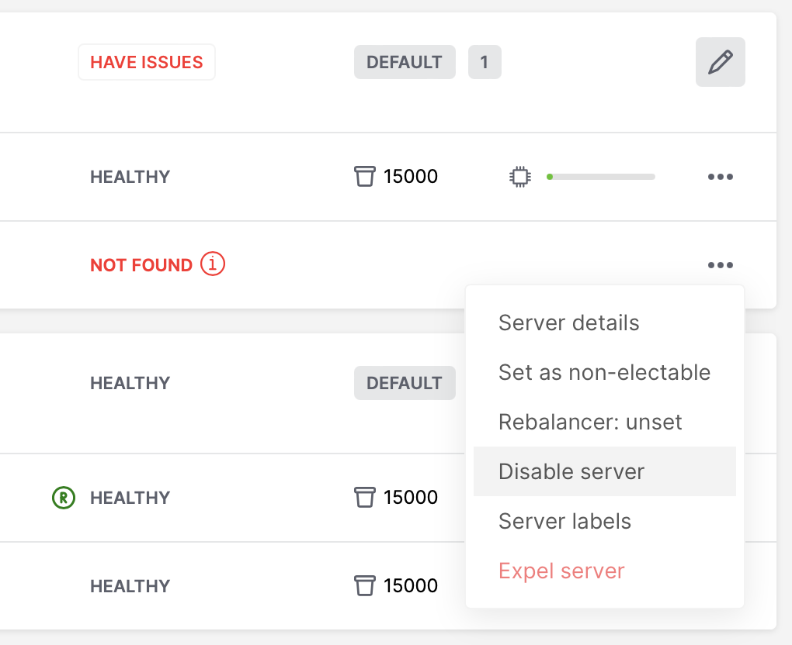

|nbsp|

Then instance will be marked as disabled and will not participate in cluster configuration:

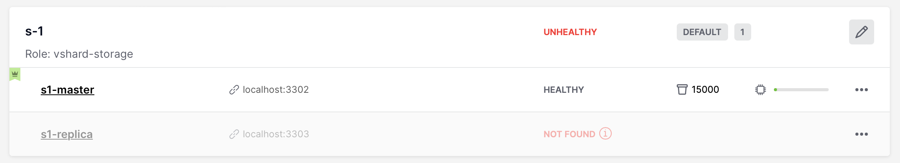

|nbsp|

You can also disable an active leader, then the leader will be switched to another instance.

Disabling/enabling instances automatically via GraphQL ``mutation { cluster { disable_servers(uuids: [...]) { } } }`` /
``mutation { cluster { enable_servers(uuids: [...]) { } } }`` call ``vshard.storage.disable()`` /
``vshard.storage.enable()`` on instances with VShard storage enabled.
**Note** that simple disable of instances via ``edit_server`` button or GraphQL won't
disable VShard storages.

Instances will be disabled automatically when a disk failure occurs
(see "issues and suggestions" topic below for details).

..  note::

    Don't forget to enable instance back after you fix them!

.. _cartridge-expelling-instances:

~~~~~~~~~~~~~~~~~~~~~~~~~~~~~~~~~~~~~~~~~~~~~~~~~~~~~~~~~~~~~~~~~~~~~~~~~~~~~~~
Expelling instances
~~~~~~~~~~~~~~~~~~~~~~~~~~~~~~~~~~~~~~~~~~~~~~~~~~~~~~~~~~~~~~~~~~~~~~~~~~~~~~~

Once an instance is *expelled*, it can never participate in the cluster again as
every instance will reject it.

To expel an instance, stop it, then click **...** next to it, then click **Expel server** and
**Expel**:

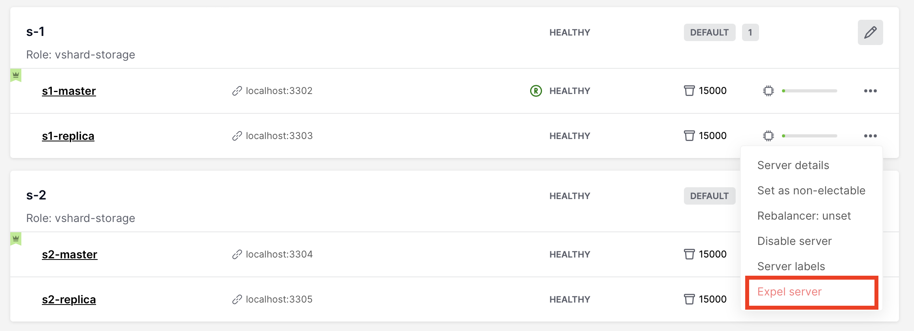

|nbsp|

..  note::

    There are two restrictions:

    *   You can't expel a leader if it has a replica. Switch leadership first.
    *   You can't expel a vshard-storage if it has buckets. Set the weight to zero
        and wait until rebalancing is completed.

Since Cartridge 2.8.0 you will see an issue if you had a replica set with an
expelled instance in ``box.space._cluster``. You can fix it by manually remove expelled
instance from ``box.space._cluster``:

..  code-block:: lua

    -- call thin on leader:
    local confapplier = require('cartridge.confapplier')
    local topology = require('cartridge.topology')
    local topology_cfg = confapplier.get_readonly('topology')
    local fun = require('fun')
    for _, uuid, _ in fun.filter(topology.expelled, topology_cfg.servers) do
        box.space._cluster.index.uuid:delete(uuid)
    end

..  note::

    * Do not expel instances until they're stopped.
    * Do not forget to clean expelled instence's data directory and remove it from
      your pipelines.
    * You can not return expelled instance to the cluster.

.. _cartridge-node-failure:

~~~~~~~~~~~~~~~~~~~~~~~~~~~~~~~~~~~~~~~~~~~~~~~~~~~~~~~~~~~~~~~~~~~~~~~~~~~~~~~
Enabling automatic failover
~~~~~~~~~~~~~~~~~~~~~~~~~~~~~~~~~~~~~~~~~~~~~~~~~~~~~~~~~~~~~~~~~~~~~~~~~~~~~~~

In a master-replica cluster configuration with automatic failover enabled, if
the user-specified master of any replica set fails, the cluster automatically
chooses a replica from the priority list and grants it the active master
role (read/write). To learn more about details of failover work, see
:ref:`failover documentation <cartridge-failover>`.

+++++++++++++++++++++++++++++++++++++++++++++++++++++++++++++++++++++++++++++++
Failover disabled (default)
+++++++++++++++++++++++++++++++++++++++++++++++++++++++++++++++++++++++++++++++

The leader is the first instance according to the topology configuration.
No automatic decisions are made. You can manually change the leader in the failover
priority list or call ``box.cfg{read_only = false}`` on any instance.

To disable failover:

#.  Click **Failover**:

    ..  image:: images/failover-button.png
        :align: left
        :scale: 40%

    |nbsp|

#.  In the **Failover control** box, select the **Disabled** mode:

    ..  image:: images/failover-disabled.png
        :align: left
        :scale: 40%

    |nbsp|

+++++++++++++++++++++++++++++++++++++++++++++++++++++++++++++++++++++++++++++++
Eventual failover (not recommended for production)
+++++++++++++++++++++++++++++++++++++++++++++++++++++++++++++++++++++++++++++++

..  important::

    The eventual failover mode is **not recommended** for use on large clusters
    in production. If you have a high load production cluster, use the stateful
    failover with ``etcd`` instead.

The leader isn’t elected consistently. Every instance thinks the leader is the
first healthy server in the replicaset. The instance health is determined
according to the membership status (the SWIM protocol).

To set the priority in a replica set:

#.  Click **Edit** next to the replica set in question.

#.  Scroll to the bottom of the **Edit replica set** box to see the list of
    servers.

#.  Drag replicas to their place in the priority list, and click **Save**:

    ..  image:: images/failover-priority.png
        :align: left
        :scale: 40%

    |nbsp|

To enable eventual failover:

#.  Click **Failover**:

    ..  image:: images/failover-button.png
        :align: left
        :scale: 40%

    |nbsp|

#.  In the **Failover control** box, select the **Eventual** mode:

    ..  image:: images/failover-eventual.png
        :align: left
        :scale: 40%

    |nbsp|

+++++++++++++++++++++++++++++++++++++++++++++++++++++++++++++++++++++++++++++++
Stateful failover
+++++++++++++++++++++++++++++++++++++++++++++++++++++++++++++++++++++++++++++++

..  important::

    The stateful failover mode with Tarantool Stateboard is **not recommended**
    for use on large clusters in production. If you have a high load production
    cluster, use the stateful failover with ``etcd`` instead.

Leader appointments are polled from the external state provider.
Decisions are made by one of the instances with the ``failover-coordinator``
role enabled. There are two options of external state provider:

- Tarantool Stateboard - you need to run instance of stateboard with command
  ``tarantool stateboard.init.lua``.

- etcd v2 - you need to run and configure etcd cluster. Note that **only etcd v2
  API is supported**, so you can still use etcd v3 with ``ETCD_ENABLE_V2=true``.

To enable stateful failover:

#.  Run stateboard or etcd

#.  Click **Failover**:

    ..  image:: images/failover-button.png
        :align: left
        :scale: 40%

    |nbsp|

#.  In the **Failover control** box, select the **Stateful** mode:

    ..  image:: images/failover-stateful.png
        :align: left
        :scale: 40%

    |nbsp|

#.  Check the necessary parameters.

In this mode, you can choose the leader with the **Promote a leader** button in the WebUI (or a
GraphQL request).

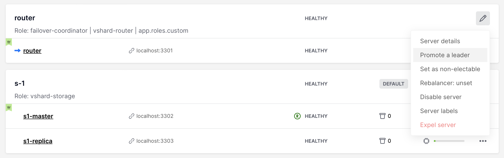

|nbsp|

You can also check state provider status in failover settings tab (it only works **after**
stateful failover was enabled):

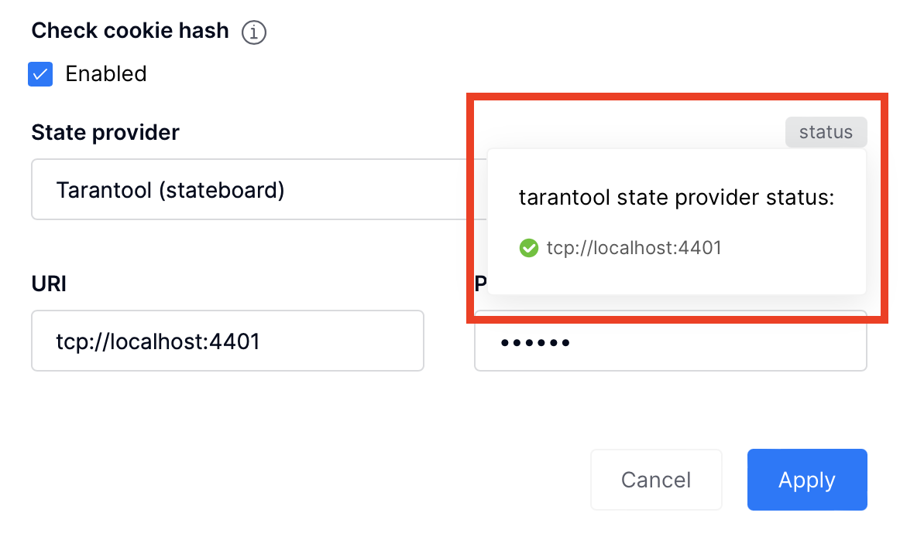

|nbsp|

+++++++++++++++++++++++++++++++++++++++++++++++++++++++++++++++++++++++++++++++
Raft failover (beta)
+++++++++++++++++++++++++++++++++++++++++++++++++++++++++++++++++++++++++++++++

..  important::

    Raft failover in Cartridge is in beta. Don't use it in production.

The replicaset leader is chosen by :ref:`built-in Raft <repl_leader_elect>`,
then the other replicasets get information about leader change from membership.
Raft parameters can be configured by environment variables.

To enable the Raft failover:

#.  Make sure that your Tarantool version is higher than 2.10.0

#.  Click **Failover**:

    ..  image:: images/failover-button.png
        :align: left
        :scale: 40%

    |nbsp|

#.  In the **Failover control** box, select the **Raft** mode:

    ..  image:: images/failover-raft.png
        :align: left
        :scale: 40%

    |nbsp|

#.  Check the necessary parameters.

In this mode, you can choose the leader with the **Promote a leader** button in the WebUI (or a
GraphQL request or manual call ``box.ctl.promote``).

|nbsp|

.. _cartridge-switch-master:

~~~~~~~~~~~~~~~~~~~~~~~~~~~~~~~~~~~~~~~~~~~~~~~~~~~~~~~~~~~~~~~~~~~~~~~~~~~~~~~
Changing failover priority list
~~~~~~~~~~~~~~~~~~~~~~~~~~~~~~~~~~~~~~~~~~~~~~~~~~~~~~~~~~~~~~~~~~~~~~~~~~~~~~~

To change failover priority list:

#.  Click the **Edit** button next to the replica set in question:

    ..  image:: images/edit-replica-set.png
        :align: left
        :scale: 40%

    |nbsp|

#.  Scroll to the bottom of the **Edit replica set** box to see the list of
    servers. The server on the top is the master.

    ..  image:: images/switch-master.png
        :align: left
        :scale: 40%

    |nbsp|

#.  Drag a required server to the top position and click **Save**.

In case of eventual failover, the new master will automatically enter the
read/write mode, while the ex-master will become read-only. This works for any roles.

.. _cartridge-users:

-------------------------------------------------------------------------------
Managing users
-------------------------------------------------------------------------------

On the **Users** tab, you can enable/disable authentication as well as add,
remove, edit, and view existing users who can access the web interface.

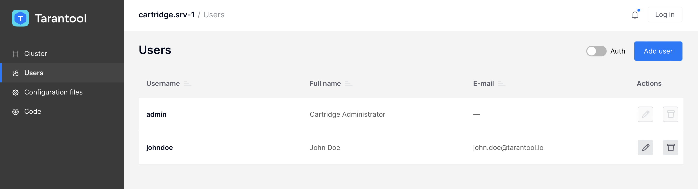

|nbsp|

Notice that the **Users** tab is available only if authorization in the web
interface is :ref:`implemented <cartridge-auth-enable>`.

Also, some features (like deleting users) can be disabled in the cluster
configuration; this is regulated by the
`auth_backend_name <https://www.tarantool.io/en/rocks/cluster/1.0/modules/cluster/#cfg-opts-box-opts>`__
option passed to ``cartridge.cfg()``.

.. _cartridge-resolve-conflicts:

-------------------------------------------------------------------------------
Resolving conflicts
-------------------------------------------------------------------------------

Tarantool has an embedded mechanism for asynchronous replication. As a consequence,
records are distributed among the replicas with a delay, so conflicts can arise.

To prevent conflicts, the special trigger ``space.before_replace`` is used. It is
executed every time before making changes to the table for which it was configured.
The trigger function is implemented in the Lua programming language. This function
takes the original and new values of the tuple to be modified as its arguments.
The returned value of the function is used to change the result of the operation:
this will be the new value of the modified tuple.

For insert operations, the old value is absent, so ``nil`` is passed as the first
argument.

For delete operations, the new value is absent, so ``nil`` is passed as the second
argument. The trigger function can also return ``nil``, thus turning this operation
into delete.

This example shows how to use the ``space.before_replace`` trigger to prevent
replication conflicts. Suppose we have a ``box.space.test`` table that is modified in
multiple replicas at the same time. We store one payload field in this table. To
ensure consistency, we also store the last modification time in each tuple of this
table and set the ``space.before_replace`` trigger, which gives preference to
newer tuples. Below is the code in Lua:

..  code-block:: lua

    fiber = require('fiber')
    -- define a function that will modify the function test_replace(tuple)
            -- add a timestamp to each tuple in the space
            tuple = box.tuple.new(tuple):update{{'!', 2, fiber.time()}}
            box.space.test:replace(tuple)
    end
    box.cfg{ } -- restore from the local directory
    -- set the trigger to avoid conflicts
    box.space.test:before_replace(function(old, new)
            if old ~= nil and new ~= nil and new[2] < old[2] then
                    return old -- ignore the request
            end
            -- otherwise apply as is
    end)
    box.cfg{ replication = {...} } -- subscribe

.. _cartridge-monitor-shard:

-------------------------------------------------------------------------------
Monitoring a cluster via CLI
-------------------------------------------------------------------------------

This section describes parameters you can monitor over the administrative
console.

.. _cartridge-manage-sharding-cli:

~~~~~~~~~~~~~~~~~~~~~~~~~~~~~~~~~~~~~~~~~~~~~~~~~~~~~~~~~~~~~~~~~~~~~~~~~~~~~~~
Connecting to nodes via CLI
~~~~~~~~~~~~~~~~~~~~~~~~~~~~~~~~~~~~~~~~~~~~~~~~~~~~~~~~~~~~~~~~~~~~~~~~~~~~~~~

Each Tarantool node (``router``/``storage``) provides an administrative console
(Command Line Interface) for debugging, monitoring, and troubleshooting. The
console acts as a Lua interpreter and displays the result in the human-readable
YAML format.

To connect to a Tarantool instance via the console, you can choose
one of the commands:

*   Using the ``tt`` CLI utility:

    ..  code-block:: bash

        $ tt connect <instance_hostname>:<port>

*   If you have cartridge-cli installed:

    ..  code-block:: bash

        $ cartridge connect <instance_hostname>:<port>

*   If you ran Cartridge locally:

    ..  code-block:: bash

        $ cartridge enter <node_name>

*   Old-fashioned way with ``tarantoolctl``:

    ..  code-block:: bash

        $ tarantoolctl connect <instance_hostname>:<port>

where the ``<instance_hostname>:<port>`` is the instance's URI.

.. _cartridge-monitor-storage:

~~~~~~~~~~~~~~~~~~~~~~~~~~~~~~~~~~~~~~~~~~~~~~~~~~~~~~~~~~~~~~~~~~~~~~~~~~~~~~~
Monitoring storages
~~~~~~~~~~~~~~~~~~~~~~~~~~~~~~~~~~~~~~~~~~~~~~~~~~~~~~~~~~~~~~~~~~~~~~~~~~~~~~~

Use ``vshard.storage.info()`` to obtain information on storage nodes.

.. _cartridge-monitor-storage-example:

+++++++++++++++++++++++++++++++++++++++++++++++++++++++++++++++++++++++++++++++
Output example
+++++++++++++++++++++++++++++++++++++++++++++++++++++++++++++++++++++++++++++++

..  code-block:: tarantoolsession

    tarantool> vshard.storage.info()
    ---
    - replicasets:
        <replicaset_2>:
        uuid: <replicaset_2>
        master:
            uri: storage:storage@127.0.0.1:3303
        <replicaset_1>:
        uuid: <replicaset_1>
        master:
            uri: storage:storage@127.0.0.1:3301
      bucket: <!-- buckets status
        receiving: 0 <!-- buckets in the RECEIVING state
        active: 2 <!-- buckets in the ACTIVE state
        garbage: 0 <!-- buckets in the GARBAGE state (are to be deleted)
        total: 2 <!-- total number of buckets
        sending: 0 <!-- buckets in the SENDING state
      status: 1 <!-- the status of the replica set
      replication:
        status: disconnected <!-- the status of the replication
        idle: <idle>
      alerts:
      - ['MASTER_IS_UNREACHABLE', 'Master is unreachable: disconnected']

.. _cartridge-monitor-storage-statuses:

+++++++++++++++++++++++++++++++++++++++++++++++++++++++++++++++++++++++++++++++
Status list
+++++++++++++++++++++++++++++++++++++++++++++++++++++++++++++++++++++++++++++++

..  container:: table

    ..  rst-class:: left-align-column-1
    ..  rst-class:: left-align-column-2

    +----------+--------------------+-----------------------------------------+
    | **Code** | **Critical level** | **Description**                         |
    +----------+--------------------+-----------------------------------------+
    | 0        | Green              | A replica set works in a regular way.   |
    +----------+--------------------+-----------------------------------------+
    | 1        | Yellow             | There are some issues, but they don’t   |
    |          |                    | affect a replica set efficiency (worth  |
    |          |                    | noticing, but don't require immediate   |
    |          |                    | intervention).                          |
    +----------+--------------------+-----------------------------------------+
    | 2        | Orange             | A replica set is in a degraded state.   |
    +----------+--------------------+-----------------------------------------+
    | 3        | Red                | A replica set is disabled.              |
    +----------+--------------------+-----------------------------------------+

.. _cartridge-monitor-storage-issues:

+++++++++++++++++++++++++++++++++++++++++++++++++++++++++++++++++++++++++++++++
Potential issues
+++++++++++++++++++++++++++++++++++++++++++++++++++++++++++++++++++++++++++++++

*   ``MISSING_MASTER`` -- No master node in the replica set configuration.

    **Critical level:** Orange.

    **Cluster condition:** Service is degraded for data-change requests to the
    replica set.

    **Solution:** Set the master node for the replica set in the configuration using API.

*   ``UNREACHABLE_MASTER`` -- No connection between the master and the replica.

    **Critical level:**

    *   If idle value doesn’t exceed T1 threshold (1 s.)---Yellow,
    *   If idle value doesn’t exceed T2 threshold (5 s.)---Orange,
    *   If idle value exceeds T3 threshold (10 s.)---Red.

    **Cluster condition:** For read requests to replica, the data may be obsolete
    compared with the data on master.

    **Solution:** Reconnect to the master: fix the network issues, reset the current
    master, switch to another master.

*   ``LOW_REDUNDANCY`` -- Master has access to a single replica only.

    **Critical level:** Yellow.

    **Cluster condition:** The data storage redundancy factor is equal to 2. It
    is lower than the minimal recommended value for production usage.

    **Solution:** Check cluster configuration:

    *   If only one master and one replica are specified in the configuration,
        it is recommended to add at least one more replica to reach the redundancy
        factor of 3.
    *   If three or more replicas are specified in the configuration, consider
        checking the replicas' states and network connection among the replicas.

*   ``INVALID_REBALANCING`` -- Rebalancing invariant was violated. During migration,
    a storage node can either send or receive buckets. So it shouldn’t be the case
    that a replica set sends buckets to one replica set and receives buckets from
    another replica set at the same time.

    **Critical level:** Yellow.

    **Cluster condition:** Rebalancing is on hold.

    **Solution:** There are two possible reasons for invariant violation:

    *   The ``rebalancer`` has crashed.
    *   Bucket states were changed manually.

    Either way, please contact Tarantool support.

*   ``HIGH_REPLICATION_LAG`` -- Replica’s lag exceeds T1 threshold (1 sec.).

    **Critical level:**

    *   If the lag doesn’t exceed T1 threshold (1 sec.)---Yellow;
    *   If the lag exceeds T2 threshold (5 sec.)---Orange.

    **Cluster condition:** For read-only requests to the replica, the data may
    be obsolete compared with the data on the master.

    **Solution:** Check the replication status of the replica. Further instructions
    are given in the
    `Tarantool troubleshooting guide <https://www.tarantool.io/en/doc/latest/book/admin/troubleshoot/>`_.

*   ``OUT_OF_SYNC`` -- Mal-synchronization occurred. The lag exceeds T3 threshold (10 sec.).

    **Critical level:** Red.

    **Cluster condition:** For read-only requests to the replica, the data may be
    obsolete compared with the data on the master.

    **Solution:** Check the replication status of the replica. Further instructions
    are given in the
    `Tarantool troubleshooting guide <https://www.tarantool.io/en/doc/latest/book/admin/troubleshoot/>`_.

.. _unreachable_replica:

*   ``UNREACHABLE_REPLICA`` -- One or multiple replicas are unreachable.

    **Critical level:** Yellow.

    **Cluster condition:** Data storage redundancy factor for the given replica
    set is less than the configured factor. If the replica is next in the queue for
    rebalancing (in accordance with the weight configuration), the requests are
    forwarded to the replica that is still next in the queue.

    **Solution:** Check the error message and find out which replica is unreachable.
    If a replica is disabled, enable it. If this doesn’t help, consider checking
    the network.

*   ``UNREACHABLE_REPLICASET`` -- All replicas except for the current one are unreachable.
    **Critical level:** Red.

    **Cluster condition:** The replica stores obsolete data.

    **Solution:** Check if the other replicas are enabled. If all replicas are
    enabled, consider checking network issues on the master. If the replicas are
    disabled, check them first: the master might be working properly.

.. _cartridge-monitor-router:

~~~~~~~~~~~~~~~~~~~~~~~~~~~~~~~~~~~~~~~~~~~~~~~~~~~~~~~~~~~~~~~~~~~~~~~~~~~~~~~
Monitoring routers
~~~~~~~~~~~~~~~~~~~~~~~~~~~~~~~~~~~~~~~~~~~~~~~~~~~~~~~~~~~~~~~~~~~~~~~~~~~~~~~

Use ``vshard.router.info()`` to obtain information on the router.

.. _cartridge-monitor-router-example:

+++++++++++++++++++++++++++++++++++++++++++++++++++++++++++++++++++++++++++++++
Output example
+++++++++++++++++++++++++++++++++++++++++++++++++++++++++++++++++++++++++++++++

..  code-block:: tarantoolsession

    tarantool> vshard.router.info()
    ---
    - replicasets:
        <replica set UUID>:
          master:
            status: <available / unreachable / missing>
            uri: <!-- URI of master
            uuid: <!-- UUID of instance
          replica:
            status: <available / unreachable / missing>
            uri: <!-- URI of replica used for slave requests
            uuid: <!-- UUID of instance
          uuid: <!-- UUID of replica set
        <replica set UUID>: ...
        ...
      status: <!-- status of router
      bucket:
        known: <!-- number of buckets with the known destination
        unknown: <!-- number of other buckets
      alerts: [<alert code>, <alert description>], ...

.. _cartridge-monitor-router-statuses:

+++++++++++++++++++++++++++++++++++++++++++++++++++++++++++++++++++++++++++++++
Status list
+++++++++++++++++++++++++++++++++++++++++++++++++++++++++++++++++++++++++++++++

..  container:: table

    ..  rst-class:: left-align-column-1
    ..  rst-class:: left-align-column-2

    +----------+--------------------+-----------------------------------------+
    | **Code** | **Critical level** | **Description**                         |
    +----------+--------------------+-----------------------------------------+
    | 0        | Green              | The ``router`` works in a regular way.  |
    +----------+--------------------+-----------------------------------------+
    | 1        | Yellow             | Some replicas are unreachable (affects  |
    |          |                    | the speed of executing read requests).  |
    +----------+--------------------+-----------------------------------------+
    | 2        | Orange             | Service is degraded for changing data.  |
    +----------+--------------------+-----------------------------------------+
    | 3        | Red                | Service is degraded for reading data.   |
    +----------+--------------------+-----------------------------------------+

.. _cartridge-monitor-router-issues:

+++++++++++++++++++++++++++++++++++++++++++++++++++++++++++++++++++++++++++++++
Potential issues
+++++++++++++++++++++++++++++++++++++++++++++++++++++++++++++++++++++++++++++++

..  note::

    Depending on the nature of the issue, use either the UUID of a replica,
    or the UUID of a replica set.

*   ``MISSING_MASTER`` -- The master in one or multiple replica sets is not
    specified in the configuration.

    **Critical level:** Orange.

    **Cluster condition:** Partial degrade for data-change requests.

    **Solution:** Specify the master in the configuration.

*   ``UNREACHABLE_MASTER`` -- The ``router`` lost connection with the master of
    one or multiple replica sets.

    **Critical level:** Orange.

    **Cluster condition:** Partial degrade for data-change requests.

    **Solution:** Restore connection with the master. First, check if the master
    is enabled. If it is, consider checking the network.

*   ``SUBOPTIMAL_REPLICA`` -- There is a replica for read-only requests, but this
    replica is not optimal according to the configured weights. This means that
    the optimal replica is unreachable.

    **Critical level:** Yellow.

    **Cluster condition:** Read-only requests are forwarded to a backup replica.

    **Solution:** Check the status of the optimal replica and its network connection.

*   ``UNREACHABLE_REPLICASET`` -- A replica set is unreachable for both read-only
    and data-change requests.

    **Critical Level:** Red.

    **Cluster condition:** Partial degrade for read-only and data-change requests.

    **Solution:** The replica set has an unreachable master and replica. Check the
    error message to detect this replica set. Then fix the issue in the same way
    as for :ref:`UNREACHABLE_REPLICA <unreachable_replica>`.

.. _cartridge-issues-suggestions:

-------------------------------------------------------------------------------
Issues and suggestions
-------------------------------------------------------------------------------

Cartridge displays cluster and instances issues in WebUI:

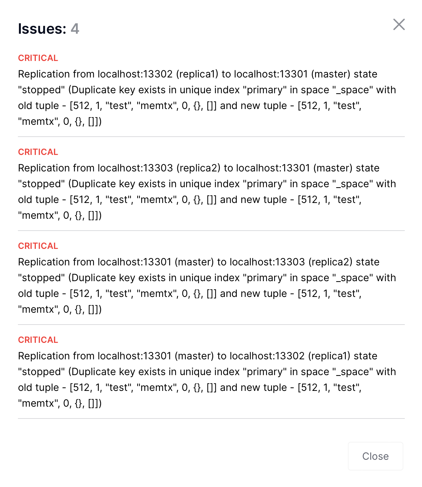

|nbsp|

*   Replication

    *   **critical**: "Replication from ... to ... isn't running" --
        when ``box.info.replication.upstream == nil``;

    *   **critical**: "Replication from ... to ... state "stopped"/"orphan"/etc. (...)";

    *   **warning**: "Replication from ... to ...: high lag" --
        when ``upstream.lag > box.cfg.replication_sync_lag``;

    *   **warning**: "Replication from ... to ...: long idle" --
        when ``upstream.idle > 2 * box.cfg.replication_timeout``;

    ..  image:: images/cartridge-issues-high-lag.png
        :align: left
        :scale: 40%

    |nbsp|

    Cartridge can propose you to fix some of replication issues by
    restarting replication:

    ..  image:: images/cluster-issues-replication.png
        :align: left
        :scale: 40%

    |nbsp|

*   Failover:

    *   **warning**: "Can't obtain failover coordinator (...)";
    *   **warning**: "There is no active failover coordinator"
        -- all of the cooridinator instances are probably dead or unavailable;
    *   **warning**: "Failover is stuck on ...: Error fetching appointments (...)";
    *   **warning**: "Failover is stuck on ...: Failover fiber is dead" -- this is likely a bug;

*   Switchover:

    *   **warning**: "Consistency on ... isn't reached yet" -- wait for the switchover to finish
        or try to restart an instance;

*   Clock:

    *   **warning**: "Clock difference between ... and ... exceed threshold" -- ``limits.clock_delta_threshold_warning``;

*   Memory:

    *   **critical**: "Running out of memory on ..." -- when all 3 metrics
        ``items_used_ratio``, ``arena_used_ratio``, ``quota_used_ratio`` from
        ``box.slab.info()`` exceed ``limits.fragmentation_threshold_critical``.
        You need to add more memory to the instance;

    *   **warning**: "Memory is highly fragmented on ..." - when
        ``items_used_ratio > limits.fragmentation_threshold_warning`` and
        both ``arena_used_ratio``, ``quota_used_ratio`` exceed critical limit.
        You can restart the instance to defragment memory or change ``box.cfg.min_tuple_size`` or
        ``box.cfg.slab_alloc_factor`` to reduce fragmentation;

*   Configuration:

    *   **warning**: "Configuration checksum mismatch on ..." -- config is probably corrupted somehow;
    *   **warning**: "Configuration is prepared and locked on ...";
    *   **warning**: "Advertise URI (...) differs from clusterwide config (...)";
    *   **warning**: "Configuring roles is stuck on ... and hangs for ... so far";

    ..  image:: images/cartridge-issues-config-mismatch.png
        :align: left
        :scale: 40%

    |nbsp|

    Cartridge can propose you to fix some of configuration issues by
    force applying configuration:

    ..  image:: images/cartridge-issues-force-apply.png
        :align: left
        :scale: 40%

    |nbsp|

*   Vshard:

    *   various vshard alerts (see vshard docs for details);

    *   **warning**: "Group "..." wasn't bootstrapped: ...".
        You need to bootstrap the group again;

    *   **warning**: "Vshard storages in replicaset ... marked as "all writable".
        You can fix it by setting ``all_rw = false`` in the replicaset configuration;

    *   **warning**: "Cluster has ... doubled buckets. Call require('cartridge.vshard-utils').find_doubled_buckets() for details"
        -- you need to call ``require('cartridge.vshard-utils').find_doubled_buckets()`` to get more info
        and then remove all duplicated data manually and then use ``vshard.storage.bucket_force_drop(bucket_id)``
        to remove the bucket. See https://github.com/tarantool/vshard/issues/412 for details.
        This issue is disabled by default. You can enable it by setting
        ``TARANTOOL_CHECK_DOUBLED_BUCKETS=true`` and then chech will run once a
        ``TARANTOOL_CHECK_DOUBLED_BUCKETS_PERIOD`` (default is 24 hours);

    You can enable extra vshard issues by setting
    ``TARANTOOL_ADD_VSHARD_STORAGE_ALERTS_TO_ISSUES=true/TARANTOOL_ADD_VSHARD_ROUTER_ALERTS_TO_ISSUES=true``
    or with ``--add-vshard-storage-alerts-to-issues/--add-vshard-router-alerts-to-issues`` command-line argument.
    It's recommended to enable router alerts in production.

*   Alien members:

    *   **warning**: "Instance ... with alien uuid is in the membership" --
        when two separate clusters share the same cluster cookie or
        when two clustes have the same first 32 symbols of cluster cookie.
        You need to change the cluster cookie on one of the clusters or set
        ``set_cookie_hash_membership`` in ``cartridge.cfg`` to ``true``;

    ..  image:: images/cartridge-issues-alien-uuid.png
        :align: left
        :scale: 40%

    |nbsp|

*   Expelled instances:

    * **warning**: "Replicaset ... has expelled instance ... in box.space._cluster" -
      when instance was expelled from replicaset, but still remains in box.space._cluster.
      You need to remove it manually;

*   Deprecated space format:

    * **warning**: "Instance ... has spaces with deprecated format: space1, ...". You need to
      convert spaces to the new format;

*   Raft issues:

    * **warning**: "Raft leader idle is 10.000 on ... .
      Is raft leader alive and connection is healthy?"

*   Unhealthy replicasets:

    *   **critical**: "All instances are unhealthy in replicaset".

    ..  image:: images/dead-replicaset-issue.png
        :align: left
        :scale: 40%

    |nbsp|

    The issue is produced when all instances in the replicaset are unhealthy
    and **not disabled**. You can disable both to get rid of the issue.

    ..  image:: images/dead-replicaset.png
        :align: left
        :scale: 40%

    |nbsp|

*   Disk failure:

    * **critical**: "Disk error on instance ...". When you see this issue,
      instances will be disabled (on instances with vshard, vshard storage will
      also be disabled) and you need to fix the disk issue manually.

*   Disabled instances:

    * **warning**: "Instance had Error and was disabled". Available only when
      ``TARANTOOL_DISABLE_UNRECOVERABLE_INSTANCES`` is set to true.
      When you see this issue, instances will be disabled and you need to fix
      the issue manually.

*   Custom issues (defined by user):

    * Custom roles can announce more issues with their own level, topic
      and message. See `custom-role.get_issues`.

*   Disable instances suggestion:

    When some instances are unhealthy, Cartridge can suggest you to disable them:

    ..  image:: images/disable-instances-suggestion.png
        :align: left
        :scale: 40%

    |nbsp|

.. _cartridge-compression-suggestions:

~~~~~~~~~~~~~~~~~~~~~~~~~~~~~~~~~~~~~~~~~~~~~~~~~~~~~~~~~~~~~~~~~~~~~~~~~~~~~~~
Compression suggestions (Enterprise only)
~~~~~~~~~~~~~~~~~~~~~~~~~~~~~~~~~~~~~~~~~~~~~~~~~~~~~~~~~~~~~~~~~~~~~~~~~~~~~~~

Since Tarantool Enterprise supporting compression, Cartridge can check if
you have spaces where you can use compression.
To enable it, click on button "Suggestions". Note that the operation can affect cluster
perfomance, so choose the time to use it wisely.

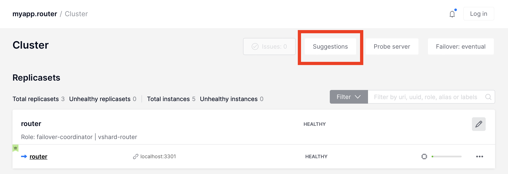

|nbsp|

You will see the warning about cluster perfomance and then click "Continue".

..  image:: images/compression-suggestion-2.png
    :align: left
    :scale: 40%

|nbsp|

You will see information about fields that can be compressed.

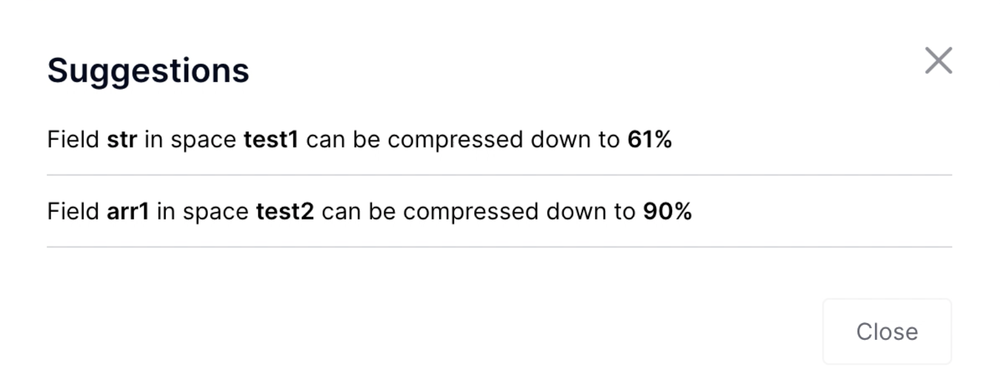

|nbsp|

.. _cartridge-instance-general-info:

-------------------------------------------------------------------------------
Instances general info
-------------------------------------------------------------------------------

You can check some general instance info in WebUI.
To see it, click on "Server details button".

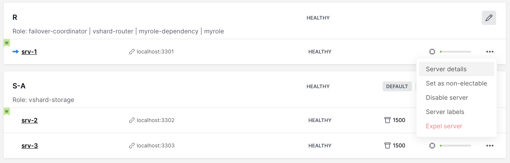

|nbsp|

And then choose one of the tabs to see various parameters:

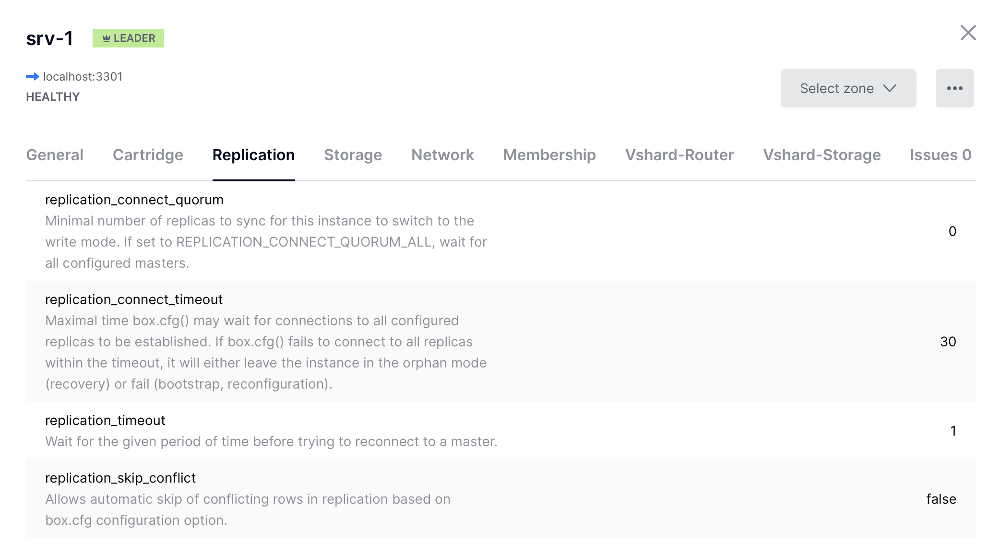

|nbsp|

.. _rebalancer-control:

-------------------------------------------------------------------------------
Rebalancer control
-------------------------------------------------------------------------------

Cartridge provides a way to control VShard rebalancer via WebUI and GraphQL API.
You can operate rebalancer mode and change rebalancer settings on each replicaset
or instance. It can be useful to stop rebalancer or choose rebalancer instance manually.

To change rebalancer mode, click on "Rebalancer mode" button next to "Failover" button
and choose desired mode (default mode is "auto" -- it's the same as rebalancer mode in
previous versions):

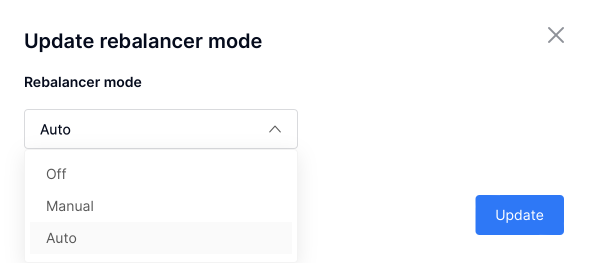

|nbsp|

To change rebalancer settings on replicaset, click on "Edit replicaset" button
and then choose desired rebalancer state ("unset" means abcence of the value):

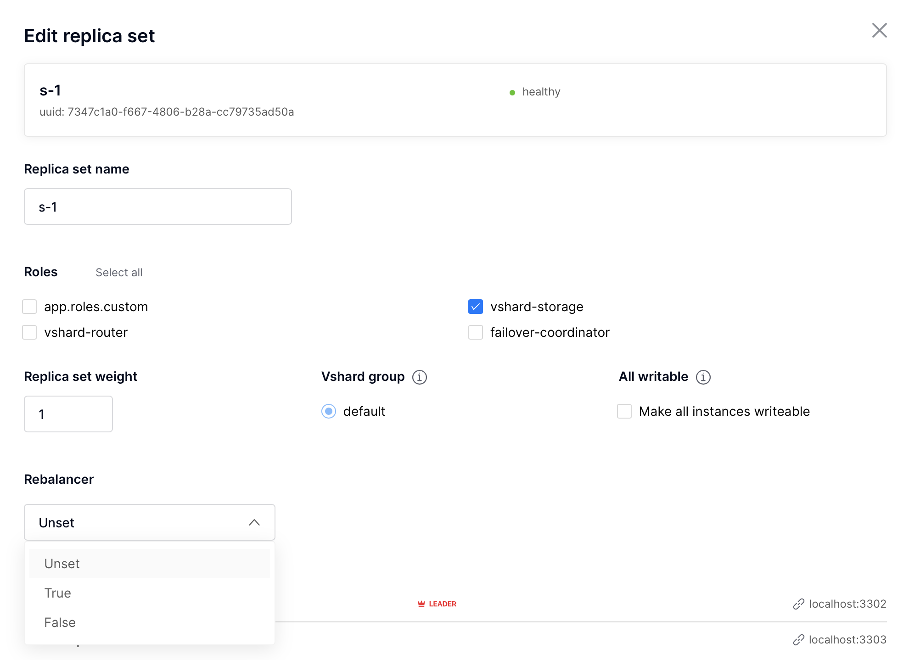

|nbsp|

To change rebalancer settings on instance, click on "..." button next to it:

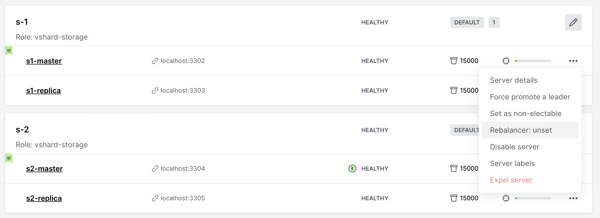

|nbsp|

And then choose desired rebalancer state ("unset" means abcence of the value):

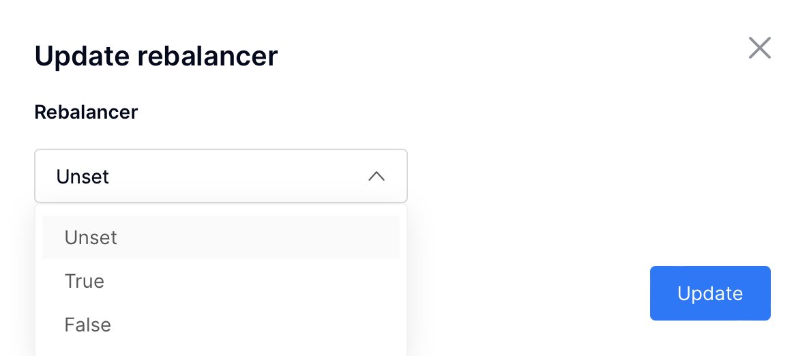

|nbsp|

You can see current settings and actual rebalancer state in WebUI. Black R means
that rebalancer is ``true`` on this instance/replicaset, grey R means that rebalancer
is ``false``  on this instance/replicaset, and green R means that rebalancer
is running on this instance:

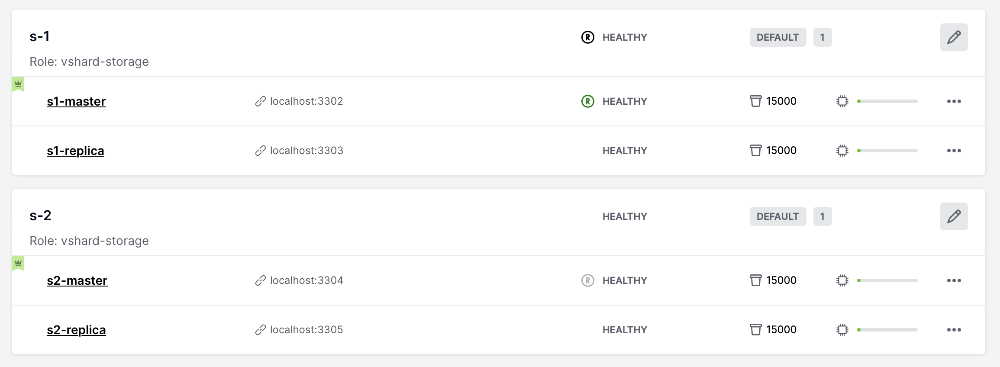

|nbsp|

See VShard documentation to get more information about rebalancer usage.

.. _zones-distances:

-------------------------------------------------------------------------------
Setting instances zones
-------------------------------------------------------------------------------

Cartridge provides a way to set zones for VShard requests.
To set zones, click on "Server details" button and then choose desired
zone or create a new one:

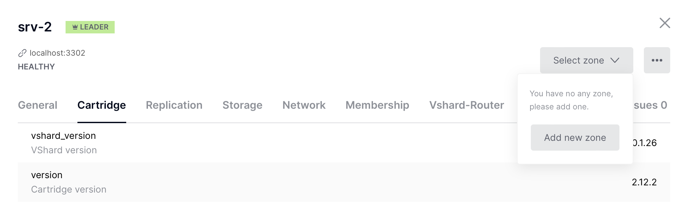

|nbsp|

OR

set zone with Lua API or GraphQL request:

..  code-block:: lua

    require('cartridge').admin_edit_topology({servers = {{uuid = uuid, zone = 'your_zone'}}})

Then you can add zone distances configuration. Simply create a new config file called
``zone_distances.yml`` and add your distances:

..  code-block:: yaml

    zone1:
      zone2: 1 # distance between zone1 and zone2
      zone3: 2
    zone2:
      zone3: 1
      # all missing distances are considered as 0

Now all of your balanced (``vshard.router.callbro`` and ``vshard.router.callbre``)
requests will be balanced between nearest zones.
Note that ``callbro`` prefers nearest (in terms of zone distances) masters, and
``callbre`` prefers nearest replicas.

.. _cartridge-migrations:

-------------------------------------------------------------------------------
Migrations
-------------------------------------------------------------------------------

Since Cartridge 2.10.0 when using ``migrations`` 1.0.0 or higher, you can use
WebUI to monitor and control you migrations.

At first, open migrations tab in the left menu. From here, you can see all migrations
status and can start migrations.

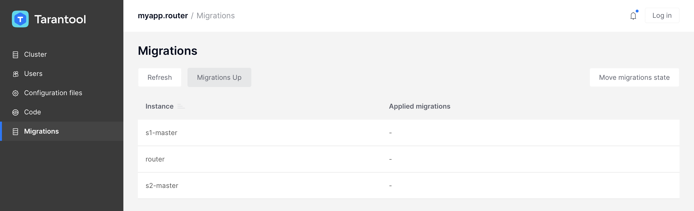

|nbsp|

After clicking on "Migration Up" button, you will see the result:

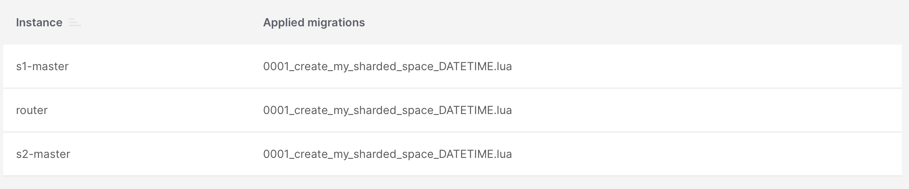

|nbsp|

.. _cartridge-ssl:

-------------------------------------------------------------------------------
SSL in Cartridge
-------------------------------------------------------------------------------

Tarantool Enterprise supports the use of SSL connections to encrypt client-server
communications for increased security. To enable SSL in Cartridge for replication
and inner cluster communications, you can use environment variables or
``cartridge.cfg`` options.

To enable SSL in Cartridge, set ``transport`` param to ``ssl`` in ``cartridge.cfg``
in your init file or add environment variable ``TARANTOOL_TRANSPORT=ssl``.
You also need to add cfg options or environment variables for the next ssl options:
``ssl_ciphers``, ``ssl_server_ca_file``, ``ssl_server_cert_file``, ``ssl_server_key_file``,
``ssl_server_password``, ``ssl_client_ca_file``, ``ssl_client_cert_file``,
``ssl_client_key_file``, ``ssl_client_password``. For details, see
`this article
<https://www.tarantool.io/ru/doc/latest/concepts/configuration/configuration_connections/#securing-connections-with-ssl>`_.

To enable http encryption, use environment variables:

*   ``TARANTOOL_HTTP_SSL_CERT_FILE``;

*   ``TARANTOOL_HTTP_SSL_KEY_FILE``;

*   ``TARANTOOL_HTTP_SSL_PASSWORD``;

*   ``TARANTOOL_HTTP_SSL_PASSWORD_FILE``;

*   ``TARANTOOL_HTTP_SSL_CA_FILE``;

*   ``TARANTOOL_HTTP_SSL_CIPHERS``.

.. _cartridge-change-cookie:

-------------------------------------------------------------------------------
Changing cluster cookie
-------------------------------------------------------------------------------

In some cases it could be useful to change cluster-cookie (e.g. when you need to fix
a broken cluster). To do it, perform next actions:

#.  (Optional) If you use stateful failover:

    ..  code-block:: lua

        -- remember old cookie hash
        local cluster_cookie = require('cartridge.cluster-cookie')

        local old_hash = cluster_cookie.get_cookie_hash()

#.  Change cluster-cookie on each instance:

    ..  code-block:: lua

        local cluster_cookie = require('cartridge.cluster-cookie')

        cluster_cookie.set_cookie(new_cookie)

        require('membership').set_encryption_key(cluster_cookie.cookie())

        if require('cartridge.failover').is_leader() then
            box.schema.user.passwd(new_cookie)
        end

#.  (Optional) If you use stateful failover:

    ..  code-block:: lua

        -- update cookie hash in a state provider
        require('cartridge.vars').new('cartridge.failover').client:set_identification_string(
            cluster_cookie.get_cookie_hash(), old_hash)

#.  Call ``apply_config`` in cluster to reapply changes to each instance:

    ..  code-block:: lua

        local confapplier = require('cartridge.confapplier')
        local clusterwide_config = confapplier.get_active_config()
        return confapplier.apply_config(clusterwide_config)

.. _cartridge-membership-change-encription-key:

-------------------------------------------------------------------------------
Changing membership encryption key
-------------------------------------------------------------------------------

Since Cartridge 2.11.0 you can use hash of cluster cookie instead
of plian cookie as encryption key in membership.

To migrate to this feature, perform next actions:

#.  Set new encryption key on each instance:

    ..  code-block:: lua

        local cluster_cookie = require('cartridge.cluster-cookie')
        local digest = require('digest')
        local membership = require('membership')

        membership.set_encryption_key(digest.md5_hex(cluster_cookie.cookie()))

#.  Set param ``set_cookie_hash_membership`` in ``cartridge.cfg`` to ``true``
    in your ``init.lua`` file, or use environment variables. Don't forget to
    persist this setting.

.. _cartridge-membership-remove-expelled:

-------------------------------------------------------------------------------
Getting rid of expelled instances in membership
-------------------------------------------------------------------------------

Sometimes, expelled instances can remain in the membership, e. g. when they
weren't finished correctly before being expelled. Those instances **can't**
cause any harm, but they can be annoying when reading membership members list.
If you are being bothered by those instances in membership, you can remove them
with the option ``cartridge.cfg({exclude_expelled_members = true})`` or with env
`TARANTOOL_EXCLUDE_EXPELLED_MEMBERS` or with command-line argument
`--exclude-expelled-members`.

Enabling this option will remove *stopped* expelled instances from the membership list.
Note that *alive* expelled instances and any instances that have the same
``membership_encryption_key`` and which can ping your cluster (like newly launched
instances which are not in the topology yet) will remain in the membership list.

.. _cartridge-fix-config:

-------------------------------------------------------------------------------
Fixing broken instance configuration
-------------------------------------------------------------------------------

It's possible that some instances have a broken configuration. To do it,
perform next actions:

*   Try to reapply configuration forcefully:

    ..  code-block:: lua

        cartridge.config_force_reapply(instaces_uuids) -- pass here uuids of broken instances

*   If it didn't work, you could try to copy a config from healthy instance:

    #. Stop broken instance and remove it's ``config`` directory.
       Don't touch any other files in working directory.

    #. Copy ``config``  directory from a healthy instance to broken one's directory.

    #. Start broken instance and check if it's working.

    #. If nothing had worked, try to carefully remove a broken instance from cluster
       and setup a new one.

.. _force-instances-remove:

-------------------------------------------------------------------------------
Forcefully removing broken instances
-------------------------------------------------------------------------------

If it isn't possible to remove a broken instance from the cluster using WebUI or
Lua API, you can try to remove it forcefully:

#. Stop broken instances.

#. Backup the instance's topology config (``config/topology.yml``) by copying it to
   another directory -- it might be helpful if something goes wrong after force-reapplying.

#. Choose a router and memorize its URI and HTTP port.

#. Go to the router's config directory and edit the topology config file. Remove
   the broken instances entrys (and the replicaset entry, if you want to remove
   full replicaset) from the topology.

#. Restart the router.

#. Go to the router's WebUI and wait until ``force apply`` suggestion.
   Then push the button to reapply config (repeat if failed).

.. _operation-error-recover:

-------------------------------------------------------------------------------
Recover from OperationError caused by a broken instance configuration
-------------------------------------------------------------------------------

It's possible that some instances have entered OperationError state after
successfully applying a new config. You can fix broken configuration with
WebUI, but if don't have an access to it, you can try to return to the previous
configuration or fix the broken one manually:

..  code-block:: lua

    local cartridge = require('cartridge')
    local config_text = require('cartridge.utils').file_read('CONFIG_PATH') -- full path to a valid config file
    cartridge.config_patch_clusterwide({['config_section.yml'] = config_text}) -- use config section name here

For example, if you have a broken metrics configuration, you can try to fix it with:

..  code-block:: lua

    local config_text = [[
    export:
      - path: '/path_for_metrics'
        format: 'json'
    ]]
    cartridge.config_patch_clusterwide({['metrics.yml'] = config_text})

.. _cartridge-upgrading_schema:

-------------------------------------------------------------------------------
Upgrading schema
-------------------------------------------------------------------------------

When upgrading Tarantool to a newer version, please don't forget to:

1.  Stop the cluster
2.  Make sure that ``upgrade_schema`` :ref:`option <cartridge.cfg>` is enabled
3.  Start the cluster again

This will automatically apply `box.schema.upgrade()
<https://www.tarantool.io/en/doc/latest/book/admin/upgrades/#admin-upgrades>`_
on the leader, according to the failover priority in the topology configuration.

.. _cartridge-recovery:

-------------------------------------------------------------------------------
Disaster recovery
-------------------------------------------------------------------------------

Please see the
`disaster recovery section <https://www.tarantool.io/en/doc/latest/book/admin/disaster_recovery/>`_
in the Tarantool manual.

.. _cartridge-backups:

-------------------------------------------------------------------------------
Backups
-------------------------------------------------------------------------------

Please see the
`backups section <https://www.tarantool.io/en/doc/latest/book/admin/backups/>`_
in the Tarantool manual.
