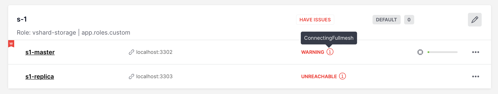

.. _cartridge-troubleshooting:

================================================================================
Troubleshooting
================================================================================

First of all, see a similar
`guide <https://www.tarantool.io/en/doc/latest/book/admin/troubleshoot/>`_
in the Tarantool manual. Below you can find other Cartridge-specific
problems considered.

~~~~~~~~~~~~~~~~~~~~~~~~~~~~~~~~~~~~~~~~~~~~~~~~~~~~~~~~~~~~~~~~~~~~~~~~~~~~~~~~~
Editing clusterwide configuration in WebUI returns an error
~~~~~~~~~~~~~~~~~~~~~~~~~~~~~~~~~~~~~~~~~~~~~~~~~~~~~~~~~~~~~~~~~~~~~~~~~~~~~~~~~

**Examples**:

* ``NetboxConnectError: "localhost:3302": Connection refused``;
* ``Prepare2pcError: Instance state is OperationError, can't apply config in this state``.

**The root problem**: all cluster instances are equal, and all of them store a
copy of clusterwide configuration, which must be the same. If an
instance degrades (can't accept new configuration) -- the quorum is lost.
This prevents further configuration modifications to avoid inconsistency.

But sometimes inconsistency is needed to repair the system, at least
partially and temporarily. It can be achieved by disabling degraded
instances.

**Solution**:

#.  Connect to the console of the alive instance.

    .. code-block:: bash

        tarantoolctl connect user:password@instance_advertise_uri

#.  Inspect what's going on.

    .. code-block:: lua

        cartridge = require('cartridge')
        report = {}
        for _, srv in pairs(cartridge.admin_get_servers()) do
            report[srv.uuid] = {uri = srv.uri, status = srv.status, message = srv.message}
        end
        return report

#.  If you're ready to proceed, run the following snippet. It'll disable
    all instances which are not healthy. After that, you can use the
    WebUI as usual.

    .. code-block:: lua

        disable_list = {}
        for uuid, srv in pairs(report) do
            if srv.status ~= 'healthy' then
               table.insert(disable_list, uuid)
            end
        end
        return cartridge.admin_disable_servers(disable_list)

#.  When it's necessary to bring disabled instances back, re-enable
    them in a similar manner:

    .. code-block:: lua

        cartridge = require('cartridge')
        enable_list = {}
        for _, srv in pairs(cartridge.admin_get_servers()) do
            if srv.disabled then
               table.insert(enable_list, srv.uuid)
            end
        end
        return cartridge.admin_enable_servers(enable_list)

.. _troubleshooting-stuck-connecting-fullmesh:

~~~~~~~~~~~~~~~~~~~~~~~~~~~~~~~~~~~~~~~~~~~~~~~~~~~~~~~~~~~~~~~~~~~~~~~~~~~~~~~~~
An instance is stuck in the ConnectingFullmesh state upon restart
~~~~~~~~~~~~~~~~~~~~~~~~~~~~~~~~~~~~~~~~~~~~~~~~~~~~~~~~~~~~~~~~~~~~~~~~~~~~~~~~~

**Example**:

**The root problem**: after restart, the instance tries to connect to all
its replicas and remains in the ``ConnectingFullmesh`` state until it
succeeds. If it can't (due to replica URI unavailability or for any
other reason) -- it's stuck forever.

**Solution**:

Set the `replication_connect_quorum <https://www.tarantool.io/en/doc/latest/reference/configuration/#cfg-replication-replication-connect-quorum>`_
option to zero. It may be accomplished in two ways:

* By restarting it with the corresponding option set
  (in environment variables or in the
  :ref:`instance configuration file <cartridge-run-systemctl-config>`);
* Or without restart -- by running the following one-liner:

  .. code-block:: bash

      echo "box.cfg({replication_connect_quorum = 0})" | tarantoolctl connect <advertise_uri>

~~~~~~~~~~~~~~~~~~~~~~~~~~~~~~~~~~~~~~~~~~~~~~~~~~~~~~~~~~~~~~~~~~~~~~~~~~~~~~~~~
I want to run an instance with a new advertise_uri
~~~~~~~~~~~~~~~~~~~~~~~~~~~~~~~~~~~~~~~~~~~~~~~~~~~~~~~~~~~~~~~~~~~~~~~~~~~~~~~~~

**The root problem**: ``advertise_uri`` parameter is persisted in the
clusterwide configuration. Even if it changes upon restart, the rest of the
cluster keeps using the old one, and the cluster may behave in an odd way.

**Solution**:

The clusterwide configuration should be updated.

#.  Make sure all instances are running and not stuck in the ConnectingFullmesh
    state (see :ref:`above <troubleshooting-stuck-connecting-fullmesh>`).

#.  Make sure all instances have discovered each other (i.e. they look
    healthy in the WebUI).

#.  Run the following snippet in the Tarantool console. It'll prepare a
    patch for the clusterwide configuration.

    .. code-block:: lua

        cartridge = require('cartridge')
        members = require('membership').members()

        edit_list = {}
        changelog = {}
        for _, srv in pairs(cartridge.admin_get_servers()) do
            for _, m in pairs(members) do
                if m.status == 'alive'
                and m.payload.uuid == srv.uuid
                and m.uri ~= srv.uri
                then
                    table.insert(edit_list, {uuid = srv.uuid, uri = m.uri})
                    table.insert(changelog, string.format('%s -> %s (%s)', srv.uri, m.uri, m.payload.alias))
                    break
                end
            end
        end
        return changelog

    As a result you'll see a brief summary like the following one:

    .. code-block:: tarantoolsession

        localhost:3301> return changelog
        ---
        - - localhost:13301 -> localhost:3301 (srv-1)
          - localhost:13302 -> localhost:3302 (srv-2)
          - localhost:13303 -> localhost:3303 (srv-3)
          - localhost:13304 -> localhost:3304 (srv-4)
          - localhost:13305 -> localhost:3305 (srv-5)
        ...

#.  Finally, apply the patch:

    .. code-block:: lua

        cartridge.admin_edit_topology({servers = edit_list})

~~~~~~~~~~~~~~~~~~~~~~~~~~~~~~~~~~~~~~~~~~~~~~~~~~~~~~~~~~~~~~~~~~~~~~~~~~~~~~~~~
The cluster is doomed, I've edited the config manually. How do I reload it?
~~~~~~~~~~~~~~~~~~~~~~~~~~~~~~~~~~~~~~~~~~~~~~~~~~~~~~~~~~~~~~~~~~~~~~~~~~~~~~~~~

.. WARNING::

    Please be aware that it's quite risky and you know what you're doing.
    There's some useful information about
    :ref:`clusterwide configuration <cartridge-config>`
    anatomy and "normal" management API.

But if you're still determined to reload the configuration manually, you can do
(in the Tarantool console):

.. code-block:: lua

    -- load config from filesystem
    clusterwide_config = require('cartridge.clusterwide-config')
    cfg = clusterwidie_config.load('./config')
    cfg:lock()

    confapplier = require('cartridge.confapplier')
    confapplier.apply_config(cfg)

This snippet reloads the configuration on a single instance. All other instances
continue operating as before.

.. NOTE::

    If further configuration modifications are made with a two-phase
    commit (e.g. via the WebUI or with the Lua API), the active configuration
    of an active instance will be spread across the cluster.
