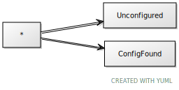
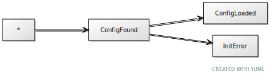
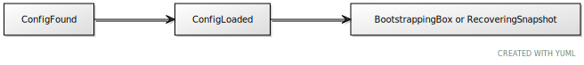
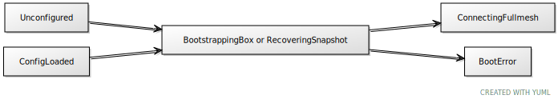
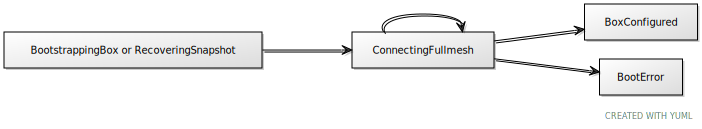
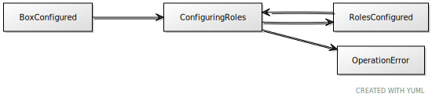

# Cluster instance lifecycle

Every instance in a cluster possesses an internal state machine. It helps to
manage cluster operation and makes describing distributed system simpler.

Instance lifecycle starts with a `cartridge.cfg` call. During initialization,
a Cartridge instance binds TCP (iproto) and UDP sockets (SWIM), checks the
working directory and, depending on circumstances, continues to one of the
following states.

## Unconfigured

If the working directory is clean and neither snapshots nor clusterwide
configuration files exist, the instance enters the `Unconfigured` state.

The instance starts accepting iproto requests (Tarantool binary
protocol) and remains in this state until the user decides to join it to the
cluster (either to create a replica set or to join an existing one).

After that, the instance moves to the `BootstrappingBox` state.

## ConfigFound

`ConfigFound` informs that all configuration files and snapshots are
found. They are not loaded though. Configuration is to be downloaded and
validated. If an error occurs during these phases, then the state is changed to
the `InitError` state. Otherwise, the instance will move to the
`ConfigLoaded` state.

## ConfigLoaded

Configuration is found, loaded and validated. The next step is configuring
the instance configuring. If snapshots are present, then the instance will
change its state to `RecoveringSnapshot`. Otherwise, it will move to
`BootstrappingBox`. By default, all instances start in the read-only mode and
don't start listening until bootstrap/recovery is completed.

## InitError

Instance initialization error. This state can be caused by the following events:

- Error occurred during `cartridge.remote-control`'s connection to the
  binary port
- Missing `config.yml` from workdir (`tmp/`), while snapshots are present
- Error loading configuration from disk
- Invalid configuration -- server is not present in the cluster configuration

## BootstrappingBox

Configuring arguments for `box.cfg`, if snapshots or configuration files are
not present. Executing `box.cfg`. Setting up users and stopping
`remote-control`. The instance will try to start listening the full-featured
iproto protocol. If the attempt fails, the instance will change its
state to `BootError`. If the replica set is not present in the clusterwide
configuration, then the instance will change its state to `BootError` as well.
If everything is ok, the instance proceeds to `ConnectingFullmesh`.

## RecoveringSnapshot

If snapshots are present, `box.cfg` will start a recovery process. After
that the process is similar to `BootstrappingBox`.

## BootError

Instance bootstrapping error. This state can be caused by the following events:

- Failed binding to the binary port for iproto usage
- Server is missing in the clusterwide configuration
- Replica set is missing in the clusterwide configuration
- Failed replication configuration

## ConnectingFullmesh

During this state, servers and replica sets are configured.
Eventually, the cluster topology described in the configuration is
applied. But in case of error, the instance state is changed to
`BootError`. Otherwise, it proceeds to configuring roles.

## BoxConfigured

This state follows successful configuration of replica sets and cluster
topology. The next step is role configuration.

## ConfiguringRoles

The state of role configuration. The instance can enter this state while the
initial setup, after a failover trigger (`failover.lua`) or after altering the
clusterwide configuration (`twophase.lua`).

## RolesConfigured

Successful role configuration.

## OperationError

Error while role configuration.
